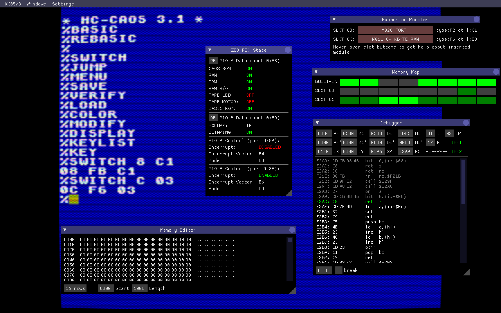
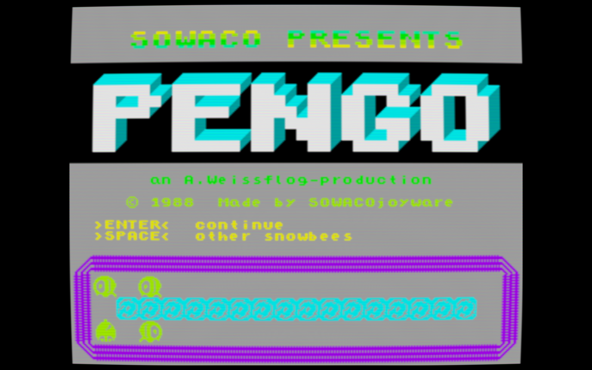
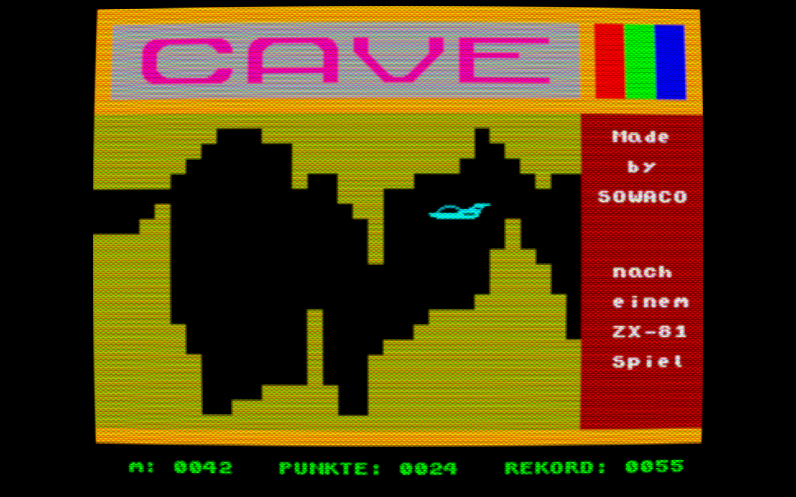
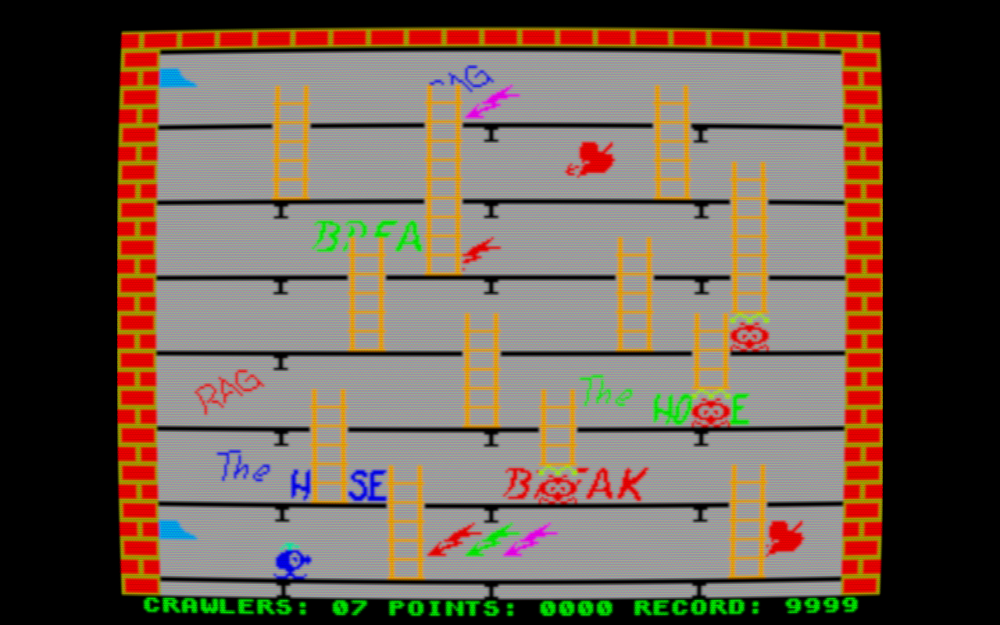

# yakc
Yet another KC emulator (WTF is a 'KC': https://en.wikipedia.org/wiki/KC_85)

[](https://travis-ci.org/floooh/yakc)

### Live Demo:

http://floooh.github.io/virtualkc/

(should work on all modern browsers with WebGL support except iOS Safari which reloads the page after a few seconds)

### How to Build:

```bash
> python --version
Python 2.7.10
> cmake --version
cmake version 3.3.2
> git clone https://github.com/floooh/yakc
> cd yakc
> ./fips gen
> ./fips make yakc
> ./fips run yakc
```

If it doesn't work out of the box (e.g. on Windows if only VS2015 is installed instead of VS2013) you need to use a different fips build config (run './fips list configs' to see the list of configs).

### Screenshots









### Goals:
- small and portable emulator core in a simple C++
- emulator core has hooks for keyboard-input, audio/video-output, load/save blocks of memory
- Oryol as input/video/audio wrapper (https://github.com/floooh/oryol)
- imgui (https://github.com/ocornut/imgui) as simple debugger overlay (view and edit registers, memory, asm/disasm)
- emulate KC85/3 and KC85/4 (bonus: the final version also has KC85/2)
- small and fast enough to feel good on browser and mobile 

### Non-Goals:
- no complete hardware emulation ('display needling', I/O ports, modules, analog cassette interface, ...) (bonus: modules are in, yay(
- no emulation of the tricky serial keyboard interface

### Potential goals:
- CPU/memory state recording to allow rewind/replay in debugger (that would be cool!) (snapshotting of current state is in, but no record/replay)
- support for other East-German 8-bitters (Z9001, Z1013, LC80)
- Speccy, CPC, KC-compact?

### Use of external code:

- for the tricky undocumented CPU flag computations I have used portions of the
MAME z80 implementation: https://github.com/mamedev/mame/blob/master/src/devices/cpu/z80/z80.c
- the debugger's disassembler is also ripped from MAME: 
https://github.com/mamedev/mame/blob/master/src/devices/cpu/z80/z80dasm.c
- the wrapper application uses Oryol as portability wrapper:
https://github.com/floooh/oryol
- the debugger UI is implemented on top of IMGUI:
https://github.com/ocornut/imgui
- the ZEXDOC/ZEXALL conformance tests by Frank D. Cringle in yakc_test 
for testing Z80 compatibility is licensed under the GPL2, the source code 
is also located in yakc_test
