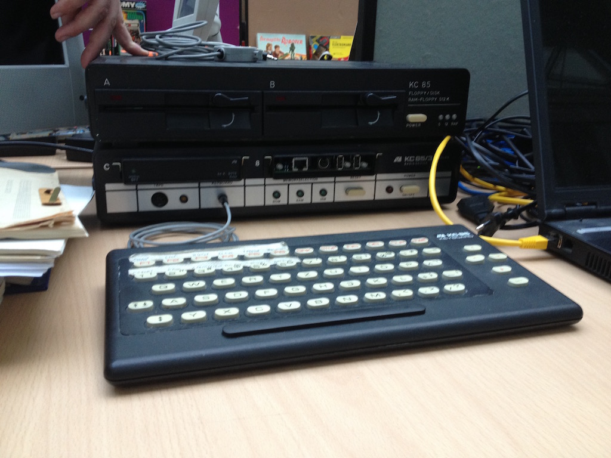
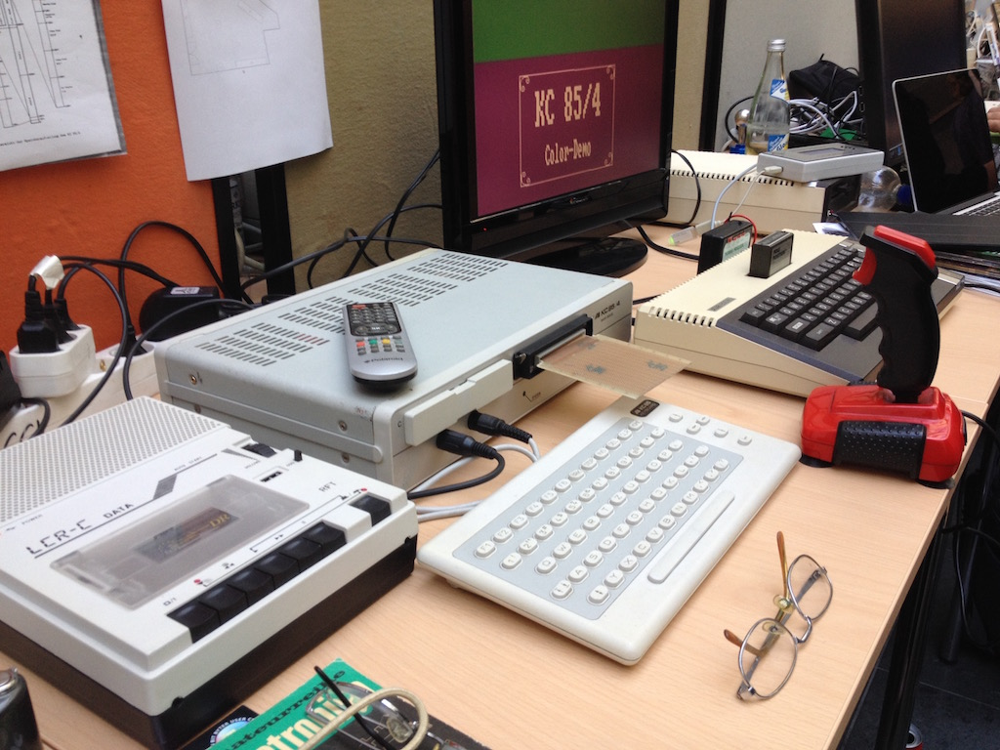
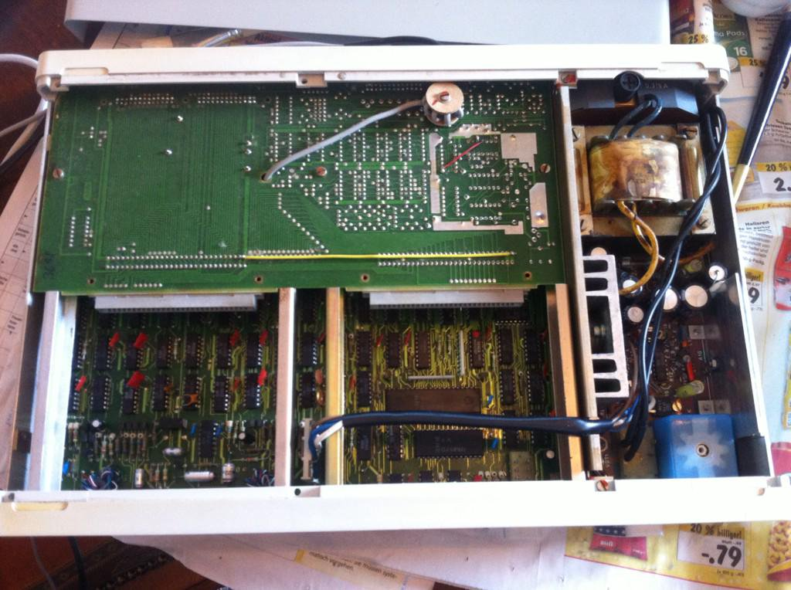
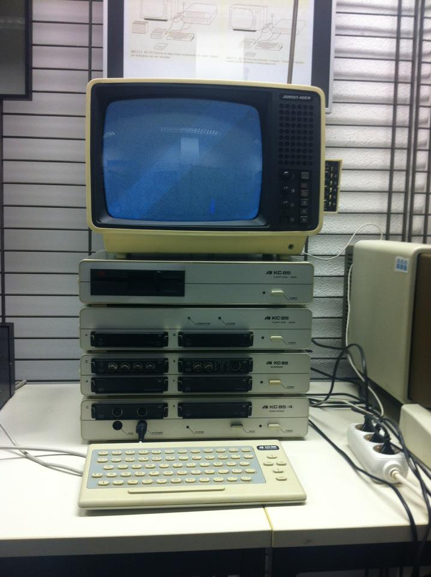

## The KC85 Computer Series

The KC85 was a series of 8-bit computers built in Eastern
Germany during the 1980's.
 
KC means 'Kleincomputer' or 'Small Computer', this was an umbrella name
for 6 different computer models with partially very different hardware 
designs and from 2 different manufacturers:

- **KC85/2 (originally HC-900), KC85/3, KC85/4**: this is the KC 'main-line' built 
by the VEB Mikroelektronikkombinat Mühlhausen
- **KC85/1 (originally Z9001), KC87**: the Z9001 and its successor the KC87
were built by Robotron Dresden, they had a different hardware architecture
and were incompatible with the KC85/2-based mainline
- **KC Compact**: this was an Amstrad CPC clone from Mühlhausen and came out too
late to make any impact

The KC85/2 and its successors were the most interesting machines, because they had 
a unique hardware and operating system design, detailed below.
From here on, the name 'KC85' will be used for the KC85/2, /3 and /4 line
of computers only.

This is a KC85/3 at the Vintage Computing Festival 2015 in Berlin with a fairly
mysterious floppy disk expansion prototype on top:

And at the same event, a KC85/4 with a breadboard expansion module and a
thematically matching cassette tape recorder (the computer in the background
is an Atari 800XL if I'm not mistaken):

  

### Hardware Specs

All computers of the KC85/2 line were based on the U880 CPU 
(an 'unlicensed' Z80 clone) running at 1.75 MHz or 1.77 MHz and didn't
have any custom chips for video or audio. The closest western 8-bit
homecomputer was probably the ZX Spectrum, which also didn't have custom
chips, had a similar video memory organisation, but was running twice as
fast at 3.5 MHz.

All KC85 models could display 320x256 pixels at 16 foreground and 8 background
colors, but with limited color resolution: a block of 8x4 pixels could be 
assigned one foreground and one background color.

The color resolution was greatly improved in the KC85/4 to 8x1 pixels. 

The KC85 models differed most in their RAM configuration:

- **KC85/2**: 
    - 16 KByte system RAM
    - 16 KByte video RAM
    - 4 KByte operating system ROM
- **KC85/3**: same RAM config as KC85/2 but
more ROM and a built-in BASIC interpreter:
    - 16 KByte system RAM
    - 16 KByte video RAM
    - 8 KByte BASIC ROM
    - 8 KByte OS ROM
- **KC85/4**: the 85/4 was a true memory monster with 128 KByte RAM:
    - 64 KByte general RAM divided into 4 16-KByte banks 
    - 64 KByte of video memory: 2 16-KByte banks for pixel data,
      and 2 16-KByte banks for color data
    - 8 KByte BASIC ROM
    - the operating system consisted of an 8 KByte ROM
      and a separate 4 KByte chunk 'behind' the BASIC ROM which was
      paged-in as needed

The KC85/4 had much improved video capabilities due to its massive 64 KByte
video RAM divided into 4 independent memory banks:

- the color resolution was improved to 8x1 pixels
- the CPU could write to 'hidden' memory banks while another bank was 
displayed, making true double-buffering possible
- a special high-color mode allowed to assign per-pixel colors, but only
with 4 different colors
- the video memory layout was 90 degrees rotated (writing to continuous 
addresses in video memory would fill vertical 8-pixel columns on screen), this
greatly simplified video memory addressing and common tasks like vertical
scrolling

The video-scanout was not programmable in any way though, so fancy scrolling 
tricks were not possible, all rendering had to be done 'manually' through 
the CPU.

This is what my KC85/4 looks like when opened:

  

### Modular Hardware and Software

The KC85/2 based series has a fairly unique modular hardware and software
concept. On the hardware side, the base device offered 2 slots for expansion
modules, and additional slots could be added by stacking 'bus-driver' devices
on top of the base device, each adding 4 more slots. Up to 4MByte RAM could 
be managed with this system, but as far as I know this could not be achieved
in reality because of signal degradation or timing problems.

This photo of a KC85/4 at a little forgotten computer-room at the HWT 
Berlin Schoeneweide demonstrates the hardware-expansion concept pretty well:

At the bottom is the KC85/4 base device (the actual computer), standing on it
is a 'D002 Busdriver' with 4 expansion slots, above a 'D004 Floppy Disk Basis'
device with it's own U880 CPU running at full 4MHz speed, followed by the
actual 'D004 Floppy Disk Drive', up to 4 of those drives could be attached
to one D004 Floppy Disk Basis device. The monitor is a Soviet black-and-white
portable TV called Junost ('Youth'). This was the typical KC computer monitor
because it was relatively cheap.

The most popular expansion modules were 16 and 64 KByte RAM modules, 
ROM modules for BASIC, FORTH and assembler development (each only 8 Kbyte big), 
serial and parallel interface modules, and 'pass-through' modules for hobbyists to
interface with their hardware.

On the software side, the built-in operating system named 'CAOS' (for Cassette-
Aided-Operating-System) was also designed with modularity and extensibility
in mind. All shell commands of the operating system had a specific
header in memory (2 bytes '7F 7F', followed by the command name, followed by 
a 01, followed by the machine code to execute). User-written programs could
expose their functionality through such standardized command headers. The 
operating system would find available commands by scanning the
memory for the magic '7F 7F' headers.

This expansibility on the hardware and software side allowed for a very 
nice working environment, it was possible to switch between different
development environments like BASIC and FORTH by bank-switching their ROM-
modules in and out, or one could extend existing development environments
by adding custom-commands.

