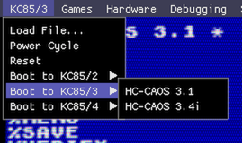
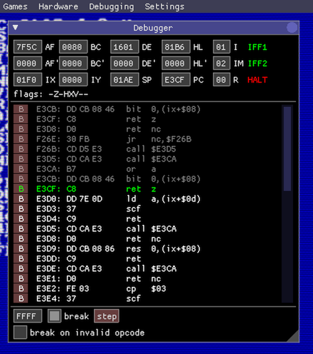
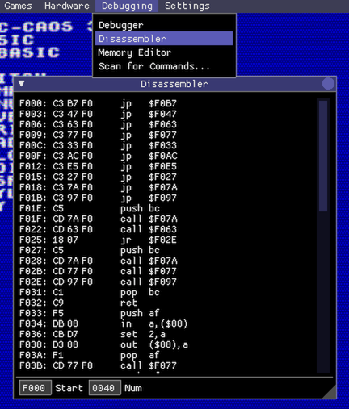
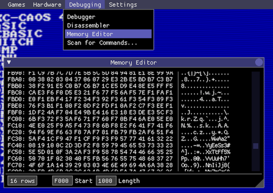
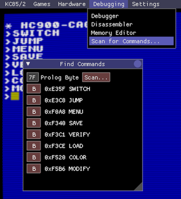
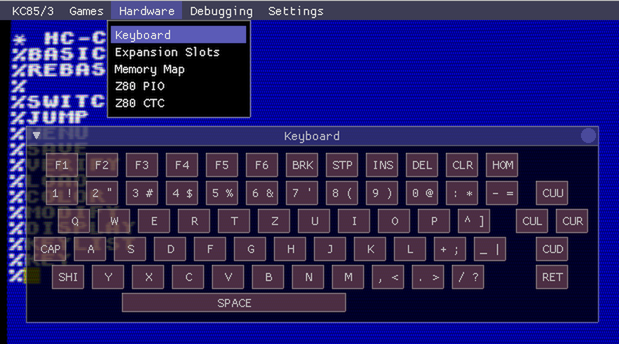
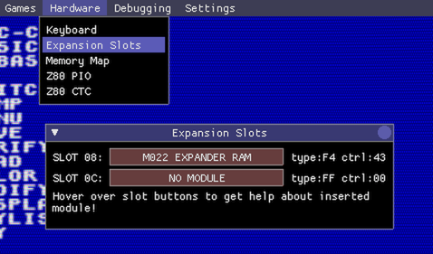
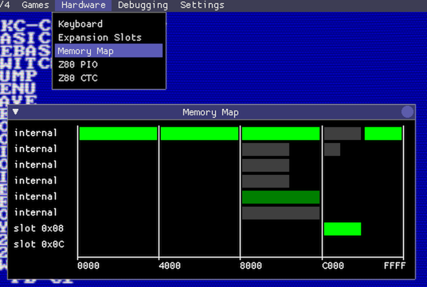
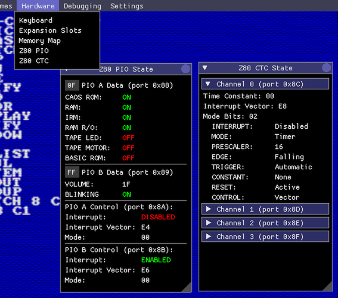
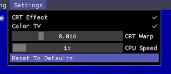

## The Debugger Overlay UI

The debugger UI is toggled by pressing the Tab key, or on devices 
with touch interface, double-tapping the screen. This displays 
a menu bar at the top of the screen through which all debugger
functions are accessible.

Please note that the debugger UI keeps changing fast, the screenshots
below may be out-of-date soon, also keep looking for new windows :)

### Rebooting into Different Configurations

The emulator can be power-cycled, reset and rebootet into different
hardware- and OS-configurations:

### The Debugger Window

This is the heart of the debugging UI, showing
the current Z80 CPU state and allowing to step through the 
disassembled instruction stream:

The debugging window updates once per frame following the
CPU as it crunches through the instruction stream. 

Pressing the **break** checkbox at the bottom halts execution and goes into
step-debug mode. The address field left to the break checkbox allows to set a
single breakpoint, or alternatively you can press the **B** buttons left of
each disassembled line to set a breakpoint at that address. At the moment only
one breakpoint is supported.

By default, the emulated Z80 CPU will skip over invalid opcodes (that's
what a real Z80 does). If you want to catch invalid opcodes, check the
**break on invalid opcode** checkbox at the bottom of the debugger window.

The top panel shows the current CPU state: register content, flags and special 
state bits (IFF1, IFF2 and HALT). The current register values can be modified
by clicking into their text fields.

The dark-grey instructions at the top of the disassembly view 
are the most recently executed instructions.

The green line is the next instruction to be executed. The current breakpoint
address is visualized with a blue-ish line (not shown in the screenshot).

Note: the debugger window will most likely become more powerful and 
get better usability in the future.

### The Disassembler Window

As the name suggests this allows to inspect disassembled instructions 
anywhere in memory. It often makes sense to have several disassembler
windows open during debugging sessions:

### The Memory Editor Window

This allows to inspect and edit memory as a hex dump. At the moment, only
memory banks that are currently visible to the CPU can be inspected, and
the content of ROM banks cannot be modified.

### Scanning for Commands

This window allows to scan the CPU-visible memory for the magic command
headers (usually 7F 7F), a list of found commands is displayed with their
starts address, and a **B** button which sets a breakpoint at the start
of the command code:

### The Virtual Keyboard

Use the virtual keyboard on touchscreen devices or to enter special
keys that don't map to PC keyboards:

### The Expansion Slot Window

This visualizes the 2 expansion slots (0x08 and 0x0C) of the base device. 
Expansion modules can be inserted or removed by cklicking on the 
expansion slot. Hovering the mouse over an expansion slot shows a brief
description of the currently inserted module.

### The Memory Map Window

Visualizes the current memory bank mapping, what memory banks currently 
exist in the system, which banks are activated, and which banks are
actually visible to the CPU:

The screenshot shows the memory map of a KC85/4 with its deeply stacked
video memory banks, there's also a ROM module inserted which is mapped to 
address C000.

The memory bank colors are as follows:

- **bright green**: the memory bank is activate and visible to the CPU
- **dark green**: the memory bank is active, but is not accessible by the
CPU because it is shadowed by a higher priority active bank
- **dark grey**: the memory bank exists but is currently switched off

The memory mapping visualization updates at 60fps, when keeping the
window open while performing operations in the emulator, it is actually
possible to watch how the memory banks are mapped in and out of the CPUs
address space.

### The PIO and CTC Windows

These two windows visualize the current state of the PIO and CTC registers.
The PIO data registers can also directly be modified in the UI:

### The Settings Menu

This allows you to switch various image post-effects on and off, and increase
the speed of the emulated CPU.

