## Hello World
{:.no_toc}
* table of conten
{:toc}

How to write a simple Hello World program in
BASIC, machine code, FORTH and assembler on a KC85/3.

### Hello World in BASIC

The KC85/3 and KC85/4 came with a built-in BASIC in ROM, for the 
KC85/2, a BASIC ROM expansion module was offered.

First start the BASIC interpreter by typing **BASIC** into the command
prompts (if you're currently on the KC85/2, first reboot into KC85/3 or
KC85/4). On start, the BASIC interpreter asks for the 'MEMORY END', simply
hit Enter there. After the interpreter has figured out how much memory is 
available, you should see the BASIC prompt:

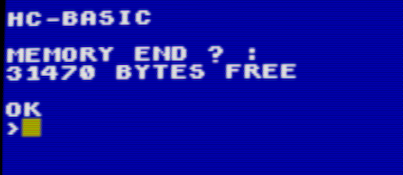

For the BASIC Hello World, we'll go fancy and print HELLO WORLD in 
a loop, changing the foreground color. 

Simply type the following, at the end of each line, press Enter. Note that
the BASIC interpreter doesn't support backspace to delete the character
before the cursor, you'll have to move the cursor left and overwrite.

~~~
AUTO
CLS
FOR I=0 TO 15
COLOR I
PRINT "HELLO WORLD!"
NEXT
[press Escape key]
~~~

The command **AUTO** goes into editor mode. Each line is started with a number
at 10-increments. To leave editor mode, press the Escape key. 

You should now see this:

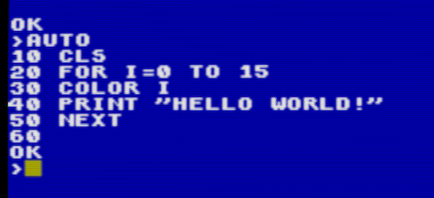

Enter the **RUN** command to execute the current program, the result should look
like this:

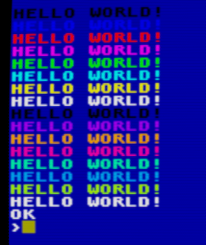

Other useful commands are **LIST** to print the current program, and 
**EDIT [line-nr]** to start editor mode at a line number.

When done, leave the BASIC interpreter with the **BYE** command.

### Hello World in Machine Code

Most performance-critical KC games were written directly in machine code, at
least before the assembler ROM module was available (or if one couldn't get
ahold of one). The process was a bit tricky since it involved a manual
translation step from assembler code to machine code:

- write down the assembler statements (called mnemonics) on paper
- manually translate those to machine code using a lookup table
- type the machine code into memory using the MODIFY command
- test and repeat

There was no way to step through the instructions or directly inspect the CPU
state, step-debugging happened in the programmer's head and on paper.

Let's dive right in, type the following into the KC85 emu, at the
end of each line, press Enter:

~~~
MODIFY 200
7F 7F ,H ,E ,L ,L ,O 01
CD 03 F0
23
,H ,E ,L ,L ,O 20
,W ,O ,R ,L ,D ,!
0D 0A
00
C9
.
~~~

After entering the dot and pressing Enter, you should be back at the
command prompt.

Now enter MENU (and Enter), there should be a new command called 'HELLO'
either at the top or bottom of the usual menu commands.

Type HELLO (+Enter), and a 'HELLO WORLD!' should be printed on the screen.

Here's a line-by-line explanation:

~~~
MODIFY 200
~~~
This starts memory editing at address 0x200 which is the typical start 
address for user code. The area below 0x200 is used mostly by the operating
system.
  

~~~
7F 7F ,H ,E ,L ,L ,O 01
~~~
This is the 'magic header' with two 7F lead-bytes which identifies the command 
to the operating system. The 'comma plus character' is a special input
mode of the MODIFY command to simplify the input of ASCII characters. What
will be written to memory is the ASCII character code. The final 01 terminates
the header meaning the command will be visible in the command list displayed
by the MENU command, the other possible value is the rarely used 00 which
is used for 'hidden' commands.
  

~~~
CD 03 F0
~~~
CD is the opcode for the _CALL nnnn_ instruction, which calls a subroutine
at address nnnn (in this case: 0xF003, which is one of the system call entry
points). The 0xF003 entry point expects the system call number after 
the CALL instruction:

~~~
23
~~~
0x23 is the system call number for the OSTR (Output String) function
which outputs a string on the screen. The string must be embedded in
the instruction stream and is terminated by a 0-byte:

~~~
,H ,E ,L ,L ,O 20
,W ,O ,R ,L ,D ,!
0D 0A
00
~~~
This is the 0-terminated string. 0x20 is the ASCII code of the space-
character, and 0D 0A are the ASCII codes for 'Enter' and 'Cursor Down', 
basically 'new line' and 'carriage return'.
  

~~~
C9
~~~
This is the Z80 RET instruction (return from subroutine), this returns
control back to the operating system.

And that's it for the machine-code Hello World. The only thing to keep in
mind for low-level programming on the KC85 systems is to leave the
IX register alone (at least while interrupts are enabled), since IX
is used as base-pointer to operating system variables located at 0x01F0.

### Hello World in FORTH

FORTH is a stack-based language with very low resource requirements
and a good balance between performance and productivity. On the KC85,
FORTH was available as a ROM module, so first thing is to insert
and activate the FORTH module:

Open the Expansion Slot window, and insert the FORTH module into slot 0x08:

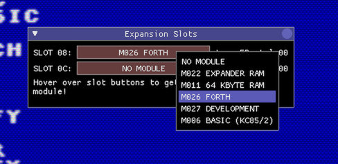

Now the FORTH module must be switched active to address C000, and the
BASIC ROM must be switched off, since this is also mapped at C000 and
has higher priority.

To switch on the FORTH module in slot 8 and map it to address C000, type
**SWITCH 8 C1**, and to switch off the built-in BASIC ROM type **SWITCH 2 0**:

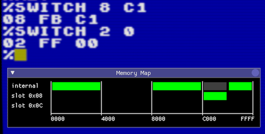

Typing **MENU** should now show 2 new entries (**FORTH** and **REFORTH**):

Ok, now start **FORTH**, the screen should clear, a message **KC - FORTH 3.1**
should show up and the FORTH system is waiting for input.

FORTH is a stack-based language, this means that data items are pushed on
a stack, and operations work on items on the stack (often removing input data
items from the stack and pushing result data items back on the stack). It is
basically like a reverse LISP, for instance, adding the numbers 3 and 2
and writing the result to the console would look like this in LISP:

~~~
(write (+ 3 2))[press Enter]
5
~~~

In FORTH, the it looks like this:

~~~
3 2 + . [press Enter] 5 OK
~~~

What happens here is that first, the numbers **3** and **2**
are pushed on the stack, then the operation **+** (add) takes the two top-most 
numbers from the stack, adds them together and puts the result back on the
stack. Then the dot-operation **.** takes the top-most number from the stack
and prints it on the console.

Now back to the HELLO WORLD sample in FORTH. We want the same colorful 
output as in the BASIC sample, so some sort of loop and setting the text
color is involved.

Enter the following in the FORTH console, at the end of each line, press Enter,
please pay special attention to the space-characters, the spaces between
character sequences are important, because FORTH only has a very primitive
parser (everything is a word, separated by spaces).

~~~
: HELLO
CR
16 0 DO
I 1 COLOR 
." HELLO WORLD!" CR
LOOP ;
~~~

What we've done here is extend FORTH by a new command (or 'word' in FORTH lingo)
called **HELLO** (a new word is introduced with **:** (colon), and finished
with **;** (semicolon), both **:** and **;** are FORTH words themselves.

**CR** prints a newline to the console. 

**16 0 DO** starts a loop with the loop counter **I** going from 0 to 15.

On the next line **I 1 COLOR** the foreground and background color for text
output is set. **I** puts the current loop counter on the stack, and **1**
is the standard blue background color.

The next line starting with the 'dot-quote' word **."** prints all
following characters to the next quote character to screen.

Finally the **LOOP** finish the loop, and the **;** (semicolon) finishes
the new word definition.

We have now created a new word **HELLO** in the FORTH dictionary. You can
print the entire dictionary with **VLIST** (press Escape to stop early).

Time to test the new word. Type **HELLO** and Enter, and you should 
see this:

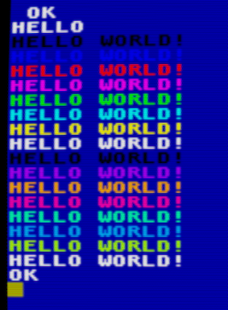

Voila :)

To leave the FORTH system and go back to CAOS, type **BYE**.

### Hello World in Assembler

Let's write the fancy Hello World program in assembly.

First insert the module 'M027 DEVELOPMENT' into slot 0x08:

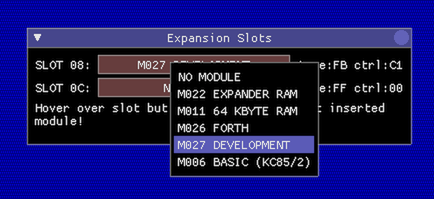

Just like the FORTH module, the DEVELOPMENT module must be activated
at address C000, and the built-in BASIC ROM must be switched off:

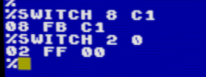

Type **MENU** to see what the DEVELOPMENT module has to offer:

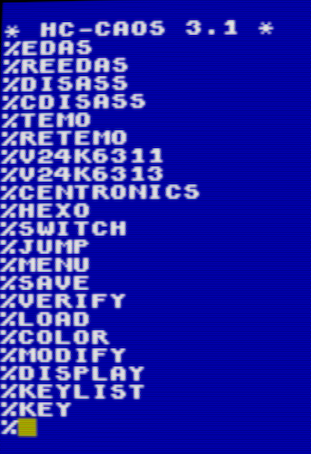

Quite a number of new commands! The only important one for now is **EDAS**
however, this enters the assembler development system. 

Type **EDAS** to start the assembler system, when the assembler asks for
the memory end, simply press Enter.

The assembler system is actually a whole IDE, with its own set of 
commands:

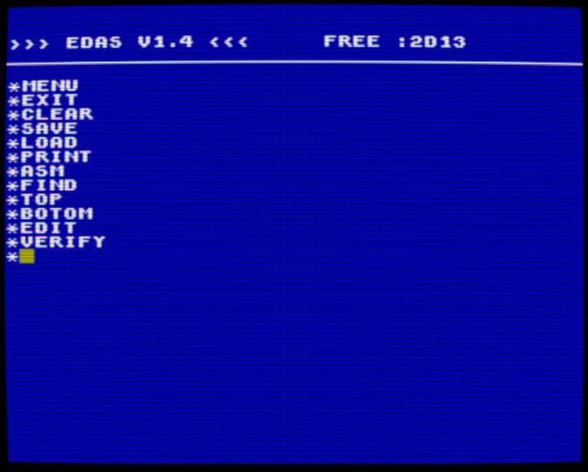

Start the editor with the **EDIT** command, and enter the following assembler
source code. 

> NOTE: Use **F1** to set the cursor to the next Tab position (the KC85
didn't have a Tab key), at the end of each line, press Escape, and when
done press Escape to leave the editor.

~~~
        DEFW 7F7FH
        DEFM 'HELLO'
        DEFB 01
        LD A,01
        LD (0B781H),A
        XOR A
LOOP:   PUSH AF
        LD L,A
        CALL 0F003H
        DEFB 0FH
        CALL 0F003H
        DEFB 23H
        DEFM 'HELLO WORLD!'
        DEFW 0D0AH
        DEFB 00
        POP AF
        INC A
        CP 10H
        JR NZ,LOOP
        RET
[press Escape]
~~~

Let's go through the code:

~~~
        DEFW 7F7FH
        DEFM 'HELLO'
        DEFB 01
~~~
This defines the magic command header so that the operating system finds
the new command called 'HELLO'.

~~~
        LD A,01
        LD (0B781H),A
~~~
This loads the value 01 into the special operating system address 0B781H
(called ARGN), this is an input parameter for the call to the system function
**0F COLOR** further down and tells the function that we only want to 
set the foreground color, but not the background color.

~~~
        XOR A
LOOP:   PUSH AF
~~~
This clears the register A to zero, and saves it on the stack. A will become
the foreground color value and loop counter. The **LOOP:** label marks the
beginning of the loop.

~~~
        LD L,A
        CALL 0F003H
        DEFB 0FH
~~~
This calls the system call **0F COLOR** which is used to set the foreground,
and optionally background color. We told the function to only set the foreground
color before when writing the value 01 to address 0B781H, and the foreground
color value is expected in L, so load L with the current loop counter A.

~~~
        CALL 0F003H
        DEFB 23H
        DEFM 'HELLO WORLD!'
        DEFW 0D0A
        DEFB 0
~~~
This calls the system function **23 OSTR** which outputs the following 
zero-terminated string to the screen.

~~~
        POP AF
        INC A
        CP 10H
        JR NZ,LOOP
        RET
~~~
This is the end of the loop. First the loop counter is popped back from the
stack into A, incremented by one and compared against 10H. As long as A hasn't
reached the value of 10H yet, the loop will repeat. Otherwise the RET
will be executed which returns control back to the operating system.

Now that the source code has been entered, it must be translated into
machine code and tested.

In the editor, press [Escape] to go back into the assembler IDE menu.

Now type **ASM** to 'assemble' the code, when asked for options, press
**O** (meaning Output):

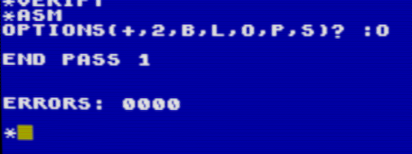

To test, leave the assembler IDE with **EXIT** to return to the CAOS command
prompt, and type **MENU** to show the system menu. There should be a new
command **HELLO**, which when executed produces the following output:

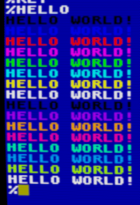

And that's it :)

